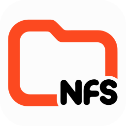
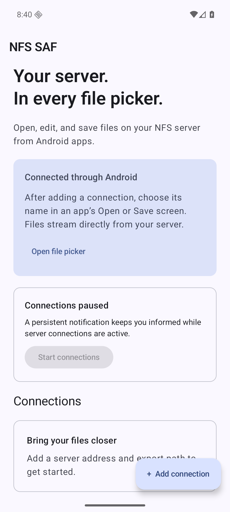
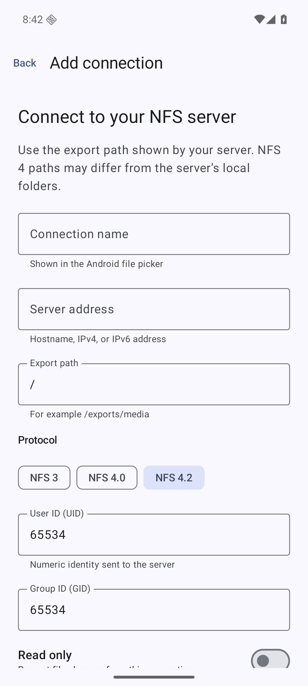

  

<h1 align="center">NFS SAF</h1>

Your NFS files, in Android's file picker.

  
  
  
  

NFS SAF connects your NAS or Linux server to Android's **Storage Access Framework**.
Open and save remote files from apps that use the system file picker—no root
required. Manage connections in a Material 3 interface built with Jetpack Compose.

## A place for your remote files

- **Open, edit and save in place.** Stream files without downloading a full copy first.
- **Use your server's identity settings.** Set numeric UID, GID and supplementary groups for each connection.
- **Choose your protocol.** NFS 4.2 by default, with NFS 4.0 and NFS 3 options.
- **Stay in control.** A persistent notification shows when connections are running and provides a Stop action.
- **Tune each connection.** Read-only access and optional read-ahead for sequential reads.

  
  &nbsp;&nbsp;
  

<em>Connection manager and setup, captured on Android 16.</em>

## Install

Requires **Android 9 or newer** on an **ARM64 or x86-64** device. Each universal
APK includes both architectures.

1. Open [Android builds](https://github.com/rupansh/NFS-SAF/actions/workflows/android.yml)
   and select a successful push or manual run.
2. Download **nfs-saf-release-universal.apk** from its **Artifacts** section. GitHub
   requires you to sign in to download workflow artifacts.
3. Open the downloaded APK and allow installation
   from your browser or file manager if Android asks.

The release APK is signed with the project's release key. A debug APK is also
available for development; switching between debug and release requires
uninstalling the other build, which removes saved connections. CI artifacts
expire after 30 days. [About GitHub artifact downloads](https://docs.github.com/en/actions/how-tos/manage-workflow-runs/download-workflow-artifacts).

## Connect your server

1. Join the same network as your NFS server, or connect through a trusted VPN.
2. Tap **Add connection**. Enter a name, server address and exported path.
3. Choose the NFS version and numeric **UID/GID** that your server expects.
   The default `65534` is commonly an anonymous identity; ask your server
   administrator if you are unsure.
4. Tap **Save & connect** and allow notifications so connection status stays visible.
5. In another app, choose **Open** or **Save**, open the system picker's sidebar,
   and select your connection.

NFS SAF supplies storage to other apps; browse your files through Android's
picker. Apps with their own private file browser may not show SAF locations.

Use **Stop connections** in the app or **Stop** in its notification when finished.
The service waits for admitted operations, commits and closes open files, then
disconnects. Start connections again in NFS SAF before reopening remote files.
Android force-stop or process termination cannot guarantee that cleanup runs.

## Server setup and troubleshooting

| Symptom | What to check |
| --- | --- |
| Access denied while connecting | Android uses unprivileged ports. Your server may need the `insecure` export option for the intended client. The app includes this guidance when a mount is denied; UID/GID and export permissions can also cause denial. |
| Export not found with NFS 4 | Use the server's NFSv4 export path. Its pseudo-root can differ from the server's local filesystem path. |
| Files are readable but cannot be changed | Check UID/GID, supplementary groups, server permissions and the connection's read-only setting. |
| Connection is visible but unavailable in the picker | Open NFS SAF and start connections. Check that your server and network are reachable. |
| Another client changed a file | Reopen it to refresh its size. Disable read-ahead when immediate visibility of external changes matters. |

For Linux exports, `insecure` means allowing source ports above 1023; it does
not grant write permission. Apply it only to the intended client or network
and reload your exports. [Linux export options](https://man7.org/linux/man-pages/man5/exports.5.html).

Use a trusted network or VPN: AUTH_SYS identities are not passwords, and this
app does not provide NFS encryption or Kerberos authentication.

## Compatibility

The app exposes regular files and directories. Symbolic links, special files
and directory renaming are not supported. Network interruptions can fail an
operation; uncertain writes are not silently repeated.

Storage tests cover real SAF and JNI access, including 60,000 randomized
operations from FreeBSD's fsx suite. Runtime validation currently covers
**NFS 4.2 on Android 16, x86-64**. Other supported Android versions, NFS 3/4.0,
and physical ARM64 devices still need broader testing.

## Project

[Report an issue](https://github.com/rupansh/NFS-SAF/issues) ·
[Build from source](docs/development.md) ·
[Signing and CI](docs/releasing.md) ·
[Storage tests](docs/testing.md) ·
[Architecture](docs/architecture.md)

Powered by [libnfs](https://github.com/sahlberg/libnfs). Application source is
[MIT licensed](LICENSE); bundled libnfs is LGPL-2.1-or-later. See
[third-party notices](THIRD_PARTY.md) for dependency and test-suite licenses.
